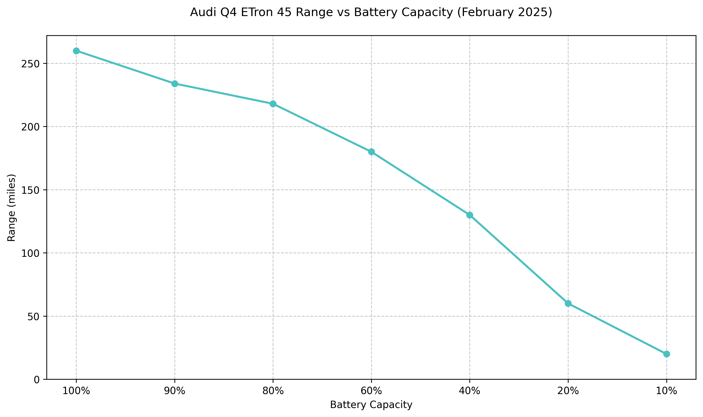

# Audi Q4 ETron 45 Range Analysis

## LLM Genearation

I used [Cline](https://cline.bot/faq) with Anthropic's Claude 3.5 sonnet model to create this code reposistory, consisting of Javascript charting definition, and HTML page and a Markdown document (this file).

After having difficulties having vscode/cline take a screenshot of the html page, I had the LLM use Python's matplotlib to create the chart and the file for embedding. In hindsight, I could have just helped the LLM start an `http.server` in order to serve the local file.

Here was the original prompt. Without intervention, the LLM got 80% of the way there until I got involved with Python.

```
My Audi Q4 ETron 45 Electric Vehicle range in February 2025 is as follows:

Battery Capacity: 100%
Range: 260 miles

Battery Capacity: 90%
Range: 234 miles

Battery Capacity: 80%
Range: 218 miles

Battery Capacity: 60%
Range: 180 miles

Battery Capacity: 40%
Range: 130 miles

Battery Capacity: 20%
Range: 60 miles

Battery Capacity: 10%
Range: 20 miles

Please plot this on a line chart and embed it in a markdown document called `README.md`
```

## Overview

This chart shows the relationship between battery capacity and available range for an Audi Q4 ETron 45 Electric Vehicle in February 2025.

## Range Chart



## Data Points

| Battery Capacity | Range (miles) |
| ---------------- | ------------- |
| 100%             | 260           |
| 90%              | 234           |
| 80%              | 218           |
| 60%              | 180           |
| 40%              | 130           |
| 20%              | 60            |
| 10%              | 20            |

## Key Observations

1. Maximum Range: At 100% battery capacity, the vehicle can travel up to 260 miles
2. Linear Degradation: Between 100% and 80%, the range decreases fairly linearly
3. Steeper Drop: Below 40% battery capacity, there's a more pronounced decrease in range
4. Emergency Reserve: At 10% battery capacity, only 20 miles of range remain

## Interactive Version

To view the interactive chart:

1. Open `index.html` in a web browser
2. Hover over data points to see exact values
3. The chart is responsive and will adjust to your screen size
